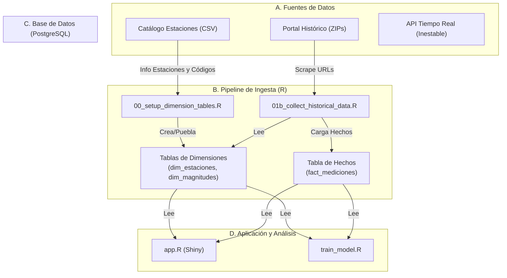

# Sistema Automatizado de Análisis y Predicción de la Calidad del Aire de Madrid

   

## 1. Resumen del Proyecto

Este repositorio contiene un pipeline de datos completo, diseñado para recolectar, procesar y almacenar datos históricos y en tiempo real sobre la calidad del aire en Madrid. El objetivo final es servir como base para un sistema de análisis y predicción que se visualizará a través de una aplicación interactiva.

El proyecto demuestra un flujo de trabajo de ingeniería de datos realista, desde la investigación de APIs y fuentes de datos dispares, pasando por la limpieza y estructuración, hasta el diseño de una base de datos relacional optimizada para el análisis.

## 2. Arquitectura del Sistema

El sistema se ha diseñado siguiendo un enfoque robusto y modular, separando la ingesta de datos, el almacenamiento y el futuro análisis.

* **Ingesta de Datos (`R Scripts`)**:
    * **Carga Histórica**: Un script (`R/01b_...`) realiza web scraping con `rvest` sobre el portal de Datos Abiertos de Madrid para obtener dinámicamente las URLs de todos los ficheros históricos anuales. Luego, procesa cada fichero ZIP, itera sobre los CSV mensuales que contiene, los transforma de formato ancho a largo usando `data.table` y los carga en la base de datos.
    * **Recolección en Tiempo Real**: Un segundo script (`R/01_...`) está diseñado para atacar la API de tiempo real. Actualmente, esta API se encuentra en un periodo de inestabilidad documentado, por lo que el foco principal del proyecto se ha pivotado hacia la consolidación del dataset histórico.

* **Almacenamiento (PostgreSQL + PostGIS)**:
    * Se ha implementado un **modelo en estrella** para optimizar el almacenamiento y la velocidad de las consultas.
    * **Tablas de Dimensiones**: Se crean tablas como `dim_estaciones` y `dim_magnitudes` que contienen metadatos descriptivos (nombres, coordenadas, unidades). La tabla de estaciones se construye combinando información de un catálogo oficial en CSV (para las coordenadas) y la documentación oficial en PDF (para los códigos).
    * **Tabla de Hechos**: La tabla `fact_mediciones` almacena únicamente las mediciones numéricas y las claves foráneas que apuntan a las tablas de dimensiones, evitando la redundancia y mejorando el rendimiento.

* **Análisis y Visualización (Fases Futuras)**:
    * **Modelado**: Se utilizará el dataset histórico para entrenar modelos geoestadísticos (Kriging con `gstat`) y de machine learning (`tidymodels`, `xgboost`).
    * **Interfaz**: Una aplicación `Shiny` con `leaflet` permitirá la visualización interactiva de los datos y las predicciones.

## 3. Diagrama de Flujo de Datos



## 4. Stack Tecnológico

* **Hardware**: Raspberry Pi 5 (Raspberry Pi OS 64-bit)
* **Base de Datos**: PostgreSQL 15 con extensión PostGIS 3
* **Lenguaje y Ecosistema**: R (v4.3+)
* **Ingeniería de Datos**: `httr2`, `rvest`, `jsonlite`, `data.table`, `DBI`, `RPostgres`
* **Análisis Geoespacial**: `sf`
* **Gestión de Dependencias**: `renv`
* **Automatización y Despliegue**: `cron`, GitHub Actions (CI/CD)
* **Logging**: `logger`
* **Visualización Futura**: `shiny`, `leaflet`, `ggplot2`, `plotly`

## 5. Estructura del Repositorio

```
.
├── R/
│   ├── 00_setup_dimension_tables.R   # Script para crear tablas de 'diccionario' (estaciones, etc.)
│   ├── 01_collect_realtime_data.R    # Script para la API en tiempo real (en pausa)
│   └── 01b_collect_historical_data.R # Script para la ingesta masiva de datos históricos
├── shiny_app/
│   └── app.R                         # Código de la aplicación Shiny (futuro)
├── data/
│   └── (Ficheros auxiliares o manuales, si son necesarios)
├── logs/
│   └── (Ficheros de log generados por los scripts)
├── .github/
│   └── workflows/
│       └── deploy.yml                # Workflow de CI/CD (futuro)
├── .Rprofile
├── renv.lock
├── .gitignore
└── README.md
```

## 6. Puesta en Marcha

Para replicar el entorno y ejecutar el pipeline, sigue estos pasos:

#### 1. Prerrequisitos
* Tener `git`, `R`, y `RStudio` instalados en tu máquina.
* Una instancia de PostgreSQL con la extensión PostGIS accesible (localmente o en red).

#### 2. Clonación y Configuración del Entorno
```bash
# 1. Clona el repositorio
git clone [https://github.com/michal0091/madrid-air-quality-system.git](https://github.com/michal0091/madrid-air-quality-system.git)
cd madrid-air-quality-system

# 2. Abre el proyecto en RStudio
```
* **Configura las credenciales:** Crea un fichero `.Renviron` en la raíz del proyecto. **Este fichero no debe subirse a Git**.
    ```
    DB_HOST="tu_host_de_bbdd" # ej: "localhost" o "air-quality-pi.local"
    DB_PORT="5432"
    DB_NAME="air_quality_db"
    DB_USER="air_quality_user"
    DB_PASSWORD="tu_contraseña_secreta"
    ```
* **Instala las dependencias:** Abre la consola de R en RStudio y restaura el entorno `renv`. Esto instalará las versiones exactas de los paquetes necesarios.
    ```R
    renv::restore()
    ```

#### 3. Ejecución del Pipeline de Datos
El orden de ejecución es importante.

* **Paso 1: Crear las tablas de dimensiones**
    Este script se ejecuta una sola vez para configurar las tablas de metadatos.
    ```R
    source("R/00_setup_dimension_tables.R")
    ```

* **Paso 2: Realizar la carga masiva de datos históricos**
    Este script descargará y procesará todos los ficheros históricos. **Atención: este proceso puede tardar bastante tiempo y consumir un ancho de banda considerable.**
    ```R
    source("R/01b_collect_historical_data.R")
    ```

Tras completar estos pasos, tendrás una base de datos PostgreSQL/PostGIS completamente poblada y lista para la fase de análisis y modelado.
